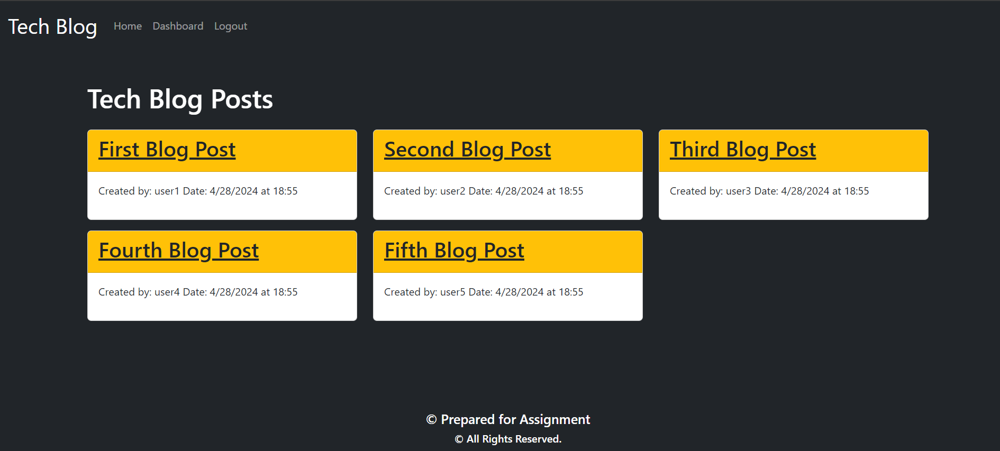

# -MVC-Tech-Blog
Model-View-Controller 

## Description
The application caters to the Tech community, providing a platform to publish blog posts expressing thoughts and opinions. Users can also engage in discussions through comments. The application follows the Model-View-Controller (MVC) paradigm, utilizing Handlebars.js for templating, Sequelize as the ORM, and express-session for authentication.

### Table of Contents

> Overview
> Usage Information
> Installation Process
> Built With

# Overview

Building this application involved creating a scalable platform supporting multiple users, blog posts, and comments while ensuring security measures for user authentication and data protection. The application adheres to modern web development standards, utilizing the MVC architecture pattern.

# Usage Information
Deployed Application Link- heroku

GitHub Repository
https://github.com/hementB2/-MVC-Tech-Blog

Screenshots

# Installation Process
Clone or download the repository from GitHub.
Open the repository in any source code editor.

# Built With
Node.js
Express.js
Handlebars.js
Sequelize ORM
bcryptjs
connect-session-sequelize
Dotenv
Express-Session

## Screenshots
Login page

Home Page

SignUp

After sign in page

